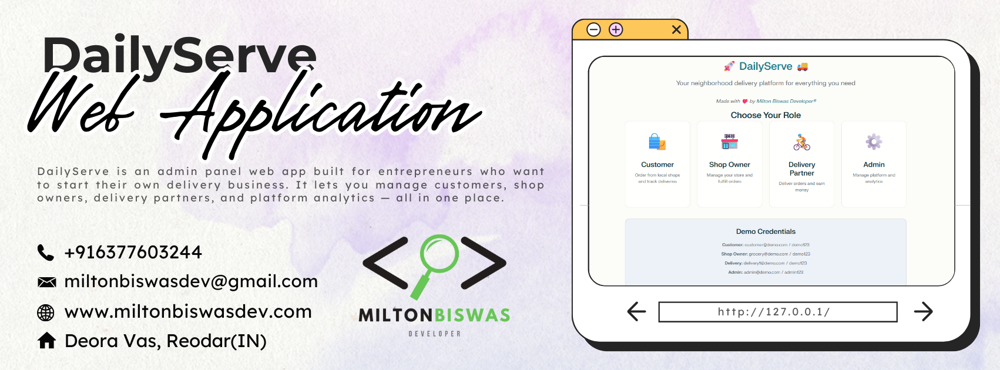

<!-- Cover Photo -->

# 🚀 DailyServe — Everything Delivered Fast

**DailyServe** is an **admin panel web app** for entrepreneurs who want to **start and manage their own local delivery business**.  
It enables **customers** to order locally, **shop owners** to manage inventory & orders, **delivery partners** to fulfill deliveries with real-time tracking, and **admins** to control the platform with analytics.  

[]()
[]()
[]()
[]()
[]()

## Table of Contents
- [Features](#features)
- [Screens](#screens)
- [Architecture](#architecture)
- [Tech Stack](#tech-stack)
- [Data Model](#data-model)
- [Quick Start](#quick-start)
  - [Prerequisites](#prerequisites)
  - [One‑Command Run (Docker)](#one-command-run-docker)
  - [Local Development (Python)](#local-development-python)
  - [Environment Variables](#environment-variables)
  - [Database & Superuser](#database--superuser)
- [Running Services](#running-services)
- [Real‑time & Background Jobs](#real-time--background-jobs)
- [API Endpoints (MVP)](#api-endpoints-mvp)
- [Testing](#testing)
- [Linting & Formatting](#linting--formatting)
- [Seeding Demo Data](#seeding-demo-data)
- [Deployment](#deployment)
- [Roadmap](#roadmap)
- [Project Structure](#project-structure)
- [Contributing](#contributing)
- [Security](#security)
- [License](#license)
- [Contact](#contact)

---

## Features
- **Authentication & Onboarding**: Role‑based registration/login for Customer, Shop Owner, Delivery Partner, Admin.
- **Products & Inventory**: Product CRUD, pricing, images, stock decrement on purchase.
- **Orders**: Cart → Checkout → Lifecycle (New → Accepted → Dispatched → Delivered).
- **Delivery Management**: Assign partners, partner accepts/updates status, periodic location updates.
- **Real‑time Updates**: WebSockets for order status and tracking.
- **Notifications**: Email/SMS hooks for order confirmed, out for delivery, and delivered.
- **Reports & Analytics**: Daily orders/revenue (shops), delivery history/earnings (partners).

## Screens
- **Customer**: Shop list, product list, cart & checkout, order tracking, order history.
- **Shop Owner**: Dashboard, product CRUD, orders list & actions, delivery assignment, reports.
- **Delivery Partner**: Assigned deliveries, accept/decline, status updates, location sharing, history/earnings.
- **Admin**: Manage users/shops, approvals, global analytics.

## Architecture
- **Backend**: Django + Django REST Framework (DRF)
- **Real‑time**: Django Channels (ASGI, WebSockets)
- **DB**: PostgreSQL (SQLite for local dev)
- **Cache/Broker**: Redis
- **Tasks**: Celery + Celery Beat
- **Frontend**: Django Templates + HTMX/Alpine.js (or optional React SPA)
- **Deployment**: Docker, Gunicorn (HTTP), Daphne/Uvicorn (ASGI/WebSockets)
- **Observability**: Sentry (errors), Prometheus/Grafana (metrics) ready
- **File Storage**: Local (dev) / S3‑compatible (prod, optional)

## Tech Stack
- **Python** 3.11+
- **Django** 5.x, DRF, Channels
- **Celery** 5.x, **Redis** 7.x
- **PostgreSQL** 14+
- **HTMX**, **Alpine.js** (or React optional)
- **Docker**, docker compose
- **Gunicorn**, **Daphne/Uvicorn**
- **pytest**, **black**, **isort**, **flake8**, **mypy**

## Data Model (simplified)
- **User**: id, name, email, phone, password, role (customer/shop/partner/admin)
- **Shop**: id, owner_id, name, address, business_hours, lat, lng
- **Product**: id, shop_id, name, price, stock, image
- **Order**: id, shop_id, customer_id, total_amount, status (new/accepted/dispatched/delivered), created_at
- **OrderItem**: id, order_id, product_id, qty, price
- **DeliveryPartner**: id, user_id, vehicle_type, status, current_lat, current_lng
- **Assignment**: id, order_id, partner_id, assigned_at, delivered_at

---

## Quick Start

### Prerequisites
- Python 3.11+
- Docker & docker compose (recommended)
- Redis and PostgreSQL (if running services without Docker)
- Node 18+ only if using a React frontend (optional)

### One‑Command Run (Docker)

#### 1) Clone repository
```bash
git clone https://github.com/your-org/local-delivery.git
cd local-delivery
```

#### 2) Configure environment
```bash
cp .env.example .env
# Edit values as needed (secrets, database, broker)
```

#### 3) Start all services
```bash
docker compose up --build
```

#### 4) Apply migrations and create superuser
```bash
docker compose exec web python manage.py migrate
docker compose exec web python manage.py createsuperuser
```

#### 5) Access
- **Web**: http://localhost:8000
- **Admin**: http://localhost:8000/admin
- **API root**: http://localhost:8000/api/

### Local Development (Python)

#### 1) Virtual environment
```bash
python -m venv .venv
source .venv/bin/activate  # Windows: .venv\Scripts\activate
```

#### 2) Install dependencies
```bash
pip install -r requirements.txt
```

#### 3) Environment
```bash
cp .env.example .env
# Set DATABASE_URL to SQLite for quick start (e.g., sqlite:///db.sqlite3)
```

#### 4) Run services (separate terminals if not using Docker)
```bash
# Terminal A
python manage.py migrate && python manage.py runserver

# Terminal B
redis-server

# Terminal C
celery -A core worker -l info

# Terminal D
celery -A core beat -l info
```

### Environment Variables (.env)
```env
DJANGO_SECRET_KEY=change-me-in-production
DJANGO_DEBUG=true
DJANGO_ALLOWED_HOSTS=localhost,127.0.0.1
DATABASE_URL=postgres://user:pass@db:5432/local_delivery  # or sqlite:///db.sqlite3
REDIS_URL=redis://redis:6379/0
CELERY_BROKER_URL=redis://redis:6379/0
CELERY_RESULT_BACKEND=redis://redis:6379/1
EMAIL_BACKEND=django.core.mail.backends.console.EmailBackend
SENTRY_DSN=
MAPS_PROVIDER_KEY=
STORAGE_BACKEND=local  # or s3
AWS_ACCESS_KEY_ID= # (optional)
AWS_SECRET_ACCESS_KEY= # (optional)
AWS_STORAGE_BUCKET_NAME= # (optional)
PAYMENT_GATEWAY=stripe|razorpay|cashfree # (optional)
PAYMENT_KEYS=... # (optional)
```

### Database & Superuser
```bash
# Migrations
python manage.py makemigrations && python manage.py migrate

# Superuser
python manage.py createsuperuser
```

---

## Running Services

### Simple Dev
```bash
# Django
python manage.py runserver

# Channels (ASGI)
daphne -b 0.0.0.0 -p 8001 core.asgi:application

# Celery worker
celery -A core worker -l info

# Celery beat
celery -A core beat -l info
```

### Docker Compose
- **web**: Django + Gunicorn
- **asgi**: Daphne/Uvicorn for Channels
- **worker**: Celery worker
- **beat**: Celery beat scheduler
- **db**: PostgreSQL
- **redis**: Redis

---

## Real‑time & Background Jobs
- **WebSockets**: `/ws/orders/{shop_id}/` for live order updates
- **Celery tasks**:
  - `send_order_notifications(order_id)`
  - `reconcile_payouts()`
  - `cleanup_archival()`
- **Periodic schedules** via Celery Beat for recurring jobs

---

## API Endpoints (MVP)

### Auth
- `POST /api/auth/register`
- `POST /api/auth/login`

### Products
- `GET /api/shops/{shop_id}/products`
- `POST /api/products/`

### Orders
- `POST /api/orders/`
- `GET /api/orders/{id}/`
- `POST /api/orders/{id}/accept`
- `POST /api/orders/{id}/assign`

### Delivery
- `POST /api/deliveries/{id}/status`
- `GET /api/partners/{id}/location`

### WebSocket
- `/ws/orders/{shop_id}/`

---

## Testing
```bash
# Run tests
pytest

# Coverage
pytest --cov=.

# Django tests
python manage.py test
```

## Linting & Formatting
```bash
flake8
black .
isort .
mypy .
```

---

## Seeding Demo Data

### Option A: Fixtures
```bash
python manage.py loaddata demo_seed.json
```

### Option B: Custom command
```bash
python manage.py seed_demo
```

## 🔑 Demo Credentials

| **Role**            | **Email(s)**                                                                 | **Password** |
|----------------------|-------------------------------------------------------------------------------|--------------|
| **Customer**         | customer@demo.com                                                            | demo123      |
| **Shop Owners**      | grocery@demo.com, pharmacy@demo.com, restaurant@demo.com, electronics@demo.com | demo123      |
| **Delivery Partners**| delivery1@demo.com, delivery2@demo.com                                        | demo123      |
| **Admin**            | admin@demo.com                                                               | admin123     |


---

## Deployment

### Production (Docker)
```bash
# Build
docker compose -f docker-compose.yml -f docker-compose.prod.yml build

# Migrate
docker compose run --rm web python manage.py migrate

# Collect static
docker compose run --rm web python manage.py collectstatic --noinput

# Up
docker compose up -d
```

### Hosting Options
- **Render**, **DigitalOcean Apps**, **AWS ECS/Fargate**, or **Azure App Service**
- **Managed PostgreSQL + Redis**
- **TLS** via Let's Encrypt/Cloudflare
- **Observability**: Sentry, Prometheus/Grafana (exporters)

### ASGI/WSGI Split
- **HTTP**: Gunicorn (WSGI)
- **WebSockets**: Daphne/Uvicorn (ASGI) as a separate service/process

### Static/Media
- **Dev**: local
- **Prod**: WhiteNoise (simple) or S3‑compatible storage (recommended)

---

## Roadmap
- [ ] **Online Payments**: Stripe/Razorpay/Cashfree
- [ ] **Push Notifications**: Firebase
- [ ] **Live Chat**: customer ↔ delivery partner
- [ ] **Marketplace**: multi‑shop search and discovery
- [ ] **PWA**: offline support
- [ ] **Geo‑optimized dispatching** and ETAs

---

## Project Structure (suggested)
```
├── core/                  # Django project (settings, asgi.py, urls.py)
├── apps/
│   ├── users/             # auth, roles
│   ├── shops/             # shop model & admin
│   ├── products/          # product & inventory
│   ├── orders/            # cart, checkout, orders, items
│   ├── delivery/          # partners, assignments, tracking
│   ├── notifications/     # email/SMS tasks
│   └── reports/           # analytics endpoints & views
├── templates/             # Django templates (HTMX/Alpine)
├── static/                # CSS/JS/assets
├── scripts/               # deploy/manage scripts
├── tests/                 # pytest suite
├── requirements.txt
├── docker-compose.yml
├── Dockerfile
├── .env.example
├── README.md
└── LICENSE
```

---

## Contributing
1. Fork the repo and create a feature branch.
2. Add tests for new functionality.
3. Ensure linting, typing, and formatting pass.
4. Open a PR with a clear description and screenshots if UI changes.

---

## Security
- Report security issues privately via email below.
- Avoid posting sensitive details in public issues.

---

## License
MIT — see LICENSE file.

---

<!-- Cover Photo -->

## Contact - **Product & Partnerships**: miltonbiswasdev@gmail.com 
- **Engineering**: miltonbiswasdev@gmail.com
- **Support**: miltonbiswasdev@gmail.com
- **LinkedIn**: https://www.linkedin.com/xmiltonbiswas
- **Website**: https://www.miltonbiswasdev.com

---

*Built with ❤️ for local communities*
